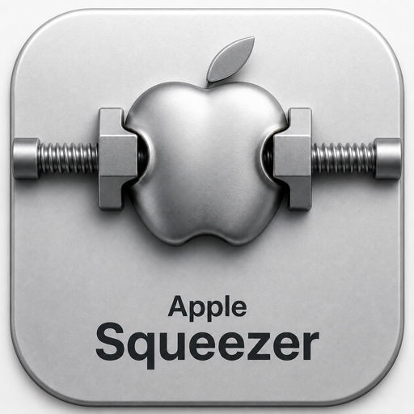

# Apple Squeezer Intel v1.0-rc4

Apple Squeezer is an Intel macOS build of Squeezelite using Apple's native
CoreAudio AUHAL output path. The release candidate targets x86_64 Macs running
macOS 11 or newer and is based on upstream Squeezelite revision 1595.

RC4 makes the CoreAudio open path survive real-world DAC behaviour. Hardware
volume and mute are written only when they are not already at unity and before
the stream starts (a control write during a running DoP stream mutes the Chord
Mojo); a hardware-rate change that the driver accepts but does not apply is
retried, then requested through the stream's physical format, and a refused
rate names the other application holding the device instead of falling back to
the shared mixer. The device is auto-selected by the LMS plugin, falls back to
shared Float32 when exclusive bit-perfect output is impossible, and reopen
retries back off from 1 s to 30 s. ALAC gapless playback no longer trims the
last packet of CoreAudio-encoded files. See `doc/release-v1.0-rc4.md`.

This is a pre-release candidate. The binaries carry an ad-hoc code signature
and are not notarized. Physical Chord Mojo qualification passed at 44.1, 48,
88.2, 96, 176.4, and 192 kHz, including native DSD64/DoP at 176.4 kHz in the
exclusive bit-perfect mode, with zero underruns, CoreAudio overloads, or
clipped samples.

The candidate provides native hardware-rate switching, physical stream-format
verification, CoreAudio latency compensation and device recovery, exclusive
and fixed-volume playback, FLAC/Ogg FLAC, ALAC, DSD64 over DoP, and an optional
VHQ PCM Studio resampling mode. It includes deployment, rollback, diagnostics,
Chord Mojo transition reporting, and bounded soak-test tools.

See [the Intel CoreAudio candidate guide](doc/coreaudio-intel-candidate.md) for
build, installation, playback modes, validation, and rollback instructions.
See [the third-party notices](THIRD_PARTY_NOTICES.md) for source attribution
and the licenses of bundled components.

## Upstream and license

Squeezelite v2.0.x, Copyright 2012-2015 Adrian Smith, 2015-2026 Ralph Irving. 
 
See the squeezelite manpage for usage details. 
https://ralph-irving.github.io/squeezelite.html 
 
This program is free software: you can redistribute it and/or modify 
it under the terms of the GNU General Public License as published by 
the Free Software Foundation, either version 3 of the License, or 
(at your option) any later version. 
 
This program is distributed in the hope that it will be useful, 
but WITHOUT ANY WARRANTY; without even the implied warranty of 
MERCHANTABILITY or FITNESS FOR A PARTICULAR PURPOSE.  See the 
GNU General Public License for more details. 
 
You should have received a copy of the GNU General Public License 
along with this program.  If not, see <http://www.gnu.org/licenses/>. 
 
Additional permission under GNU GPL version 3 section 7 
 
If you modify this program, or any covered work, by linking or
combining it with OpenSSL (or a modified version of that library),
containing parts covered by the terms of The OpenSSL Project, the
licensors of this program grant you additional permission to convey
the resulting work. {Corresponding source for a non-source form of
such a combination shall include the source code for the parts of
OpenSSL used as well as that of the covered work.} 
 
Contains dsd2pcm library Copyright 2009, 2011 Sebastian Gesemann which 
is subject to its own license. 
 
Contains the Daphile Project full dsd patch Copyright 2013-2017 Daphile, 
which is subject to its own license. 
 
Option to allow server side upsampling for PCM streams (-W) from 
squeezelite-R2 (c) Marco Curti 2015, marcoc1712@gmail.com. 
 
This software uses libraries from the FFmpeg project under 
the LGPLv2.1 and its source can be downloaded from 
https://sourceforge.net/projects/lmsclients/files/source/ 
